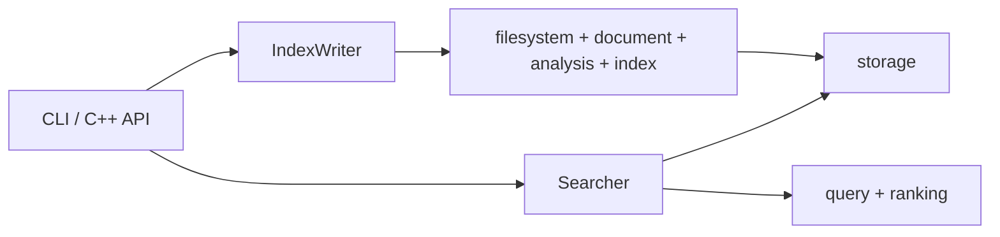

# 项目结构与后续计划

## 项目定位

SnowSeek 0.2 是面向嵌入式 Linux 的本地全文检索引擎，使用 C++20，实现完整构建、
增量更新、删除、压缩、布尔与短语查询、BM25 排序，以及可崩溃恢复的持久化发布。
运行时不依赖第三方库。

公开 C++ 接口只有：

- `snowseek/index.hpp`：`IndexWriter`、维护结果和索引校验；
- `snowseek/search.hpp`：`Searcher`、查询选项和命中结果；
- `snowseek/version.hpp`：版本常量。

AST、Tokenizer、DocumentStore、倒排表、BM25、Segment 和 Manifest 均为
`src` 私有实现。

## 目录结构

| 目录 | 职责 |
|---|---|
| `include/snowseek` | 稳定的 0.2 公共 C++ API |
| `src/filesystem` | 递归扫描、过滤和确定性路径排序 |
| `src/document` | UTF-8 流式读取与文档元数据 |
| `src/analysis` | ASCII Token 化、归一化和位置记录 |
| `src/index` | 完整构建、增量计划、批次提交与维护编排 |
| `src/storage` | Segment v2、Manifest v1、校验、归并和原子发布 |
| `src/query` | 私有查询 AST、解析和布尔/短语求值 |
| `src/ranking` | BM25 评分 |
| `src/cli` | 参数解析、命令分发和稳定输出 |
| `tests` | 无第三方测试框架的单元与集成测试 |
| `benchmarks` | 可选的确定性构建基准 |
| `cmake/toolchains` | 嵌入式 Linux 交叉编译配置 |

依赖方向保持单向：



## 索引流程

### 完整构建


文件先完整解析，再分配 DocumentId 和提交 Posting，失败文件不会留下半成品。
解析可以并行，提交始终按扫描顺序执行，因此线程调度不会改变最终索引字节。

活动批次达到资源档位的容量阈值后，在文档边界刷写临时 Segment。输入超过
`merge_fan_in` 时逐层归并；候选文件通过完整校验后才进入发布事务。

### 增量维护

`update` 使用文件大小、纳秒 mtime 和原始内容 CRC32C 判断新增与修改，源中消失
的路径写入 Tombstone。`remove` 使用大小写敏感 POSIX Glob 选择可见路径。
两者通常追加一个 delta Segment；活动 Segment 超过 16 个时尝试自动压缩。

`compact` 将最终可见文档重写为一个 Segment，删除 Tombstone、被覆盖记录和失效
Posting，并重新分配连续 DocumentId。自动压缩失败只产生维护诊断，原 delta 仍可
发布。

## 查询流程


`Searcher` 构造时加载一个不可变 generation。查询支持显式或隐式 `AND`、`OR`、
`NOT`、括号、精确或有序邻近短语、末尾前缀，以及 `path:`、`extension:`、
`size:` 和 `mtime:` 过滤。前缀直接从已加载的有序词典展开，整条查询最多产生 256
个不同词项，不改变 Segment v2。匹配文档按正向具体词项的 BM25 之和排序，分数
相同时按相对路径排序；评分解释和原文读取只针对最终 Top-K。

Minimal 档位不保存 Position，因此仍支持词项、布尔、过滤和 BM25，但拒绝短语查询。

## 存储与可靠性

索引目录由一个 `MANIFEST` 和一个或多个不可变 Segment 组成，精确布局见
[index-format.md](index-format.md)。0.2 reader 只接受 Manifest v1 和 Segment v2。

writer 在目录 fd 上持有独占 `flock`，按“写入并同步候选 Segment → 写入并同步
临时 Manifest → 原子替换 `MANIFEST`”发布。Manifest rename 是唯一逻辑提交点：

- 提交前失败继续使用旧 generation；
- 提交后才清理退休 Segment；
- 清理失败返回诊断，并由下一次 writer 重试；
- reader 无锁读取，跨越并发提交时重试，最终只看到完整旧版本或完整新版本。

内存预算统计文档、词典、Posting 和构建中间数据的逻辑容量，不等于 RSS；临时空间
预算统计私有工作区文件及发布暂存副本的逻辑长度，不等于文件系统块配额。默认工作区
位于索引目录；配置 `temporary_directory` 后，工作区位于指定的已存在目录，最终候选
始终复制到索引目录暂存后再发布。构建写入检查临时文件系统，候选回拷和 Manifest
暂存则单独检查索引文件系统；逻辑峰值包含两份候选同时存在的窗口。

正常退出会删除外部工作区，索引目录内的 Segment 暂存残留由下一次 writer 清理。
崩溃遗留在共享外部目录的工作区不自动清理，以免不同索引共用临时根目录时相互误删。

## 测试与构建

常用检查：

```bash
cmake -S . -B build
cmake --build build
(cd build && ctest --output-on-failure)
./tools/test-matrix.sh
```

`test-matrix.sh` 覆盖 GCC/Clang × Debug/Release，并可启用 `-Werror`。格式、损坏
数据、多 Segment 可见性、资源上限、并发 writer 和发布故障点均有集成测试。

## 后续 TODO

按优先级推进：

1. 在 AArch64 设备复测 RSS、构建吞吐、查询延迟和跨架构索引兼容性。
2. 基于实测评估 Posting/Position 的 Delta + Varint、Skip/Galloping Search，以及
   `pread` 与 `mmap`；需要改变磁盘字节时使用新格式版本，不修改 v2 契约。
3. 可选增加轻量 C/C++ Lexer 和 `symbol:`、`comment:` 字段；解析失败必须安全
   降级为普通文本索引。

每项性能优化都应附带可复现的前后数据；没有测量收益时保持现有实现。
