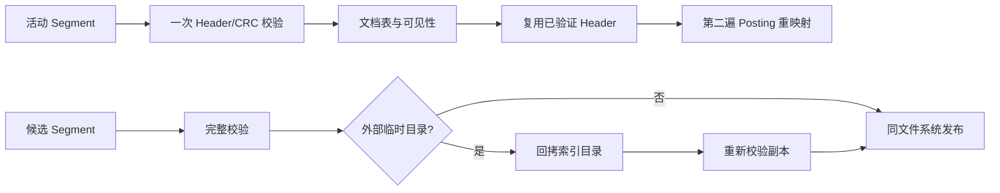

# 索引维护性能优化

## 范围

本轮优化针对 `rebuild`、`update` 和 `compact` 的 CPU 热点，不改变 Segment v2、
Manifest v1、查询结果、发布提交点或临时空间口径。优化前火焰图用于定位问题，统一维护
基准用于比较前后耗时。

## 火焰图

火焰图使用 64 MiB 确定性语料和带调试符号、frame pointer 的 `RelWithDebInfo` 构建，
通过以下固定周期配置采集全线程用户态调用栈：

```bash
perf record -e cycles:u -c 1000000 -g --call-graph fp
```

缓存准备不在采样窗口内。图中宽度表示 on-CPU 样本比例，不包含 I/O 等待；父子调用栈
的比例存在包含关系，不能直接相加。

优化前后使用相同语料、缓存准备和 perf 参数：

| 操作 | 缓存 | 优化前 | 优化后 |
|---|---|---|---|
| rebuild | cold | [查看 SVG](assets/performance/rebuild-cold-before.svg) | [查看 SVG](assets/performance/rebuild-cold-after.svg) |
| rebuild | hot | [查看 SVG](assets/performance/rebuild-hot-before.svg) | [查看 SVG](assets/performance/rebuild-hot-after.svg) |
| update | cold | [查看 SVG](assets/performance/update-cold-before.svg) | [查看 SVG](assets/performance/update-cold-after.svg) |
| update | hot | [查看 SVG](assets/performance/update-hot-before.svg) | [查看 SVG](assets/performance/update-hot-after.svg) |
| compact | cold | [查看 SVG](assets/performance/compact-cold-before.svg) | [查看 SVG](assets/performance/compact-cold-after.svg) |
| compact | hot | [查看 SVG](assets/performance/compact-hot-before.svg) | [查看 SVG](assets/performance/compact-hot-after.svg) |

优化前主要热点如下：

| 场景 | 主要 on-CPU 热点 |
|---|---|
| rebuild | Segment 校验约 32%；逐字节流读写与 CRC32C 合计占据主要叶节点 |
| update | `read_index_directory` 约 53%；CRC32C 约 25%，逐字节读取约 21% |
| compact | Segment 校验约 44%；逐字节读取约 20%，CRC32C 约 19% |

冷、热缓存调用栈近似，说明瓶颈主要来自解码、校验和重复工作，而不是文件内容页是否已在
缓存中。

## 实现

1. [binary_codec.cpp](../src/storage/binary_codec.cpp) 将 32/64 位整数从逐字节
   `get`/`put` 改为一次 `read`/`write`，磁盘字节序保持不变。
2. [checksum.cpp](../src/storage/checksum.cpp) 将串行逐字节 CRC32C 改为可移植的
   slicing-by-8，不依赖特定 CPU 指令。
3. [index_validation.cpp](../src/storage/index_validation.cpp) 在文档表加载后保留已验证
   Header，Posting 重映射的第二遍逻辑解码不再重复读取 Header 和计算 section CRC。
4. [index_directory.cpp](../src/storage/index_directory.cpp) 让 update/remove/compact
   直接读取 writer 锁保护的 generation，并删除默认发布路径上的第二次候选完整校验。

当前数据流为：



两遍 Posting 解码仍然保留：第一遍验证所有物理记录并建立可见性，第二遍只物化仍可见的
Posting，以维持多 Segment 加载时的内存上界。外部临时目录的回拷副本也继续重新完整
校验。

## 前后结果

测量日期为 2026-08-28。使用同一 Release benchmark、256 个 65536-byte 文件、4096
词表、修改 1 个文件，每个“操作 × 缓存”组合采样 3 次。下表为 P50；样本数较少，只
用于验证本次改动方向，不替代 100 样本正式基线。

| 场景 | 优化前（ms） | 优化后（ms） | 降幅 |
|---|---:|---:|---:|
| rebuild cold | 991.1 | 612.2 | 38.2% |
| rebuild hot | 938.4 | 600.1 | 36.1% |
| update cold | 637.3 | 244.4 | 61.7% |
| update hot | 604.5 | 208.1 | 65.6% |
| compact cold | 1130.6 | 375.3 | 66.8% |
| compact hot | 1123.7 | 368.1 | 67.2% |

写放大没有变化：rebuild 为 `1.424`，update 为 `4.062`，compact 为 `0.990`；冷、热
缓存结果相同。因此耗时下降来自减少 CPU 工作，没有通过省略持久化写入换取性能。

## 验证与边界

- benchmark 配置下 23 项 CTest 全部通过；
- GCC/Clang × Debug/Release `-Werror` 共 88 项测试通过；
- sanitizer 构建的 22 项测试通过；
- Segment v2、Manifest v1、Manifest rename 提交点和跨文件系统副本校验保持不变。

优化后火焰图记录了当前热点分布，可作为下一轮优化的起点。跨机器、文件系统或编译配置
的数字不可直接比较；再次修改热路径后应使用相同采样参数生成新的对照图。
